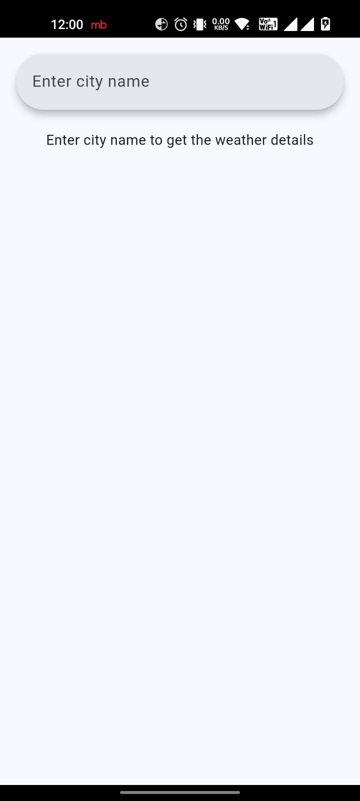
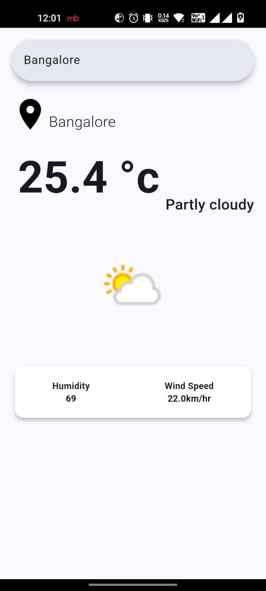

# WeatherApp

WeatherApp is a weather application built with a Flutter frontend and a Java-based backend using Servlets for persistence. The app displays weather details such as temperature, humidity, and wind speed for a searched city. The backend stores the last searched city to display its weather by default on app startup.

## Features

- Search for weather by city name
- Display current temperature, weather condition, humidity, and wind speed
- Backend persistence to load the last searched city's weather on app startup
- RESTful API endpoints for managing preferred locations

## Project Structure

```
/home/den/Documents/code/flutter-projs/weatherapp/
├── backend
│   ├── src
│   │   ├── main
│   │   │   ├── java
│   │   │   │   └── weatherapp
│   │   │   │       ├── PreferredLocationDAO.java
│   │   │   │       ├── PreferredLocationModel.java
│   │   │   │       └── WeatherAPIController.java
│   │   │   └── resources
│   │   │       └── ddl.sql
│   └── WEB-INF
│       ├── classes
│       └── lib
├── frontend
│   ├── lib
│   │   ├── api.dart
│   │   ├── constants.dart
│   │   ├── homepage.dart
│   │   ├── main.dart
│   │   ├── prefapi.dart
│   │   ├── prefmodel.dart
│   │   └── weathermodel.dart
├── README.md
└── LICENSE
```

## Getting Started

### Prerequisites

Read the documentation for the backend: [here](backend/README.md)
Read the documentation for the frontend: [here](frontend/README.md)

#### Backend
- JDK (Java Development Kit): [Install JDK](https://www.oracle.com/java/technologies/javase-downloads.html)
- Apache Tomcat or another Java Servlet container: [Install Tomcat](https://tomcat.apache.org/download-90.cgi)
- PostgreSQL: [Install PostgreSQL](https://www.postgresql.org/download/)
- JDBC Driver for PostgreSQL: [Download Driver](https://jdbc.postgresql.org/download.html)

#### Frontend
- Flutter SDK: [Install Flutter](https://flutter.dev/docs/get-started/install)
- A weather API key from [WeatherAPI](https://www.weatherapi.com/)

### Installation

#### Backend Setup

1. Set up the PostgreSQL database:
    - Create a new PostgreSQL database.
    - Run the `ddl.sql` script located at `backend/src/main/resources/ddl.sql` to create the necessary tables:

    ```sql
    CREATE TABLE preferred_locations (
        id SERIAL PRIMARY KEY,
        preferred_location VARCHAR(255) NOT NULL
    );
    ```

2. Update database connection details in `PreferredLocationDAO.java`:

    ```java
    private final String url = "jdbc:postgresql://localhost:5432/yourdb"; // replace 'yourdb' with your database name
    private final String user = "youruser"; // replace 'youruser' with your username
    private final String password = "yourpassword"; // replace 'yourpassword' with your password
    ```

3. Download the PostgreSQL JDBC driver and place it in the `lib` directory of your servlet container (e.g., Tomcat).

4. Build and deploy the backend:
    - Compile the Java code:

    ```bash
    javac -cp "path-to-tomcat-lib/servlet-api.jar;path-to-postgresql-driver/postgresql.jar" -d backend/WEB-INF/classes backend/src/main/java/weatherapp/*.java
    ```

    - Package the web application (e.g., into a WAR file) and deploy it on your servlet container.

#### Frontend Setup

1. Navigate to the frontend directory:

    ```bash
    cd /home/den/Documents/code/flutter-projs/weatherapp/frontend
    ```

2. Install Flutter dependencies:

    ```bash
    flutter pub get
    ```

3. Replace the placeholder (`#########`) in `constants.dart` with your actual weather API key:

    ```dart
    String apiKey = "your_api_key_here";
    ```

4. Update the backend URL in `prefapi.dart` to point to your running backend server.

### Running the Application

1. Ensure your PostgreSQL database is running.
2. Start your Tomcat or other servlet container with the deployed backend.
3. Run the Flutter application from the frontend directory:

    ```bash
    flutter run
    ```

## Usage

1. Open the app.
2. If a city was last searched, its weather details will be displayed automatically.
3. Enter the name of a new city in the search bar to get updated weather details.

## API Endpoints

### Backend

#### `GET /location`
Retrieves the preferred location from the database.

#### `POST /location`
Updates the preferred location in the database.

## Screenshots




## Contributing

Contributions are welcome! Feel free to submit a pull request or open an issue to suggest improvements or report bugs.

## License

This project is licensed under the MIT License - see the [LICENSE](LICENSE) file for details.

## Acknowledgements

- [Flutter](https://flutter.dev/) - UI toolkit
- [WeatherAPI](https://www.weatherapi.com/) - Weather data provider
- [Apache Tomcat](https://tomcat.apache.org/) - Servlet container
- [PostgreSQL](https://www.postgresql.org/) - Database
- [Gson](https://github.com/google/gson) - JSON library

---

