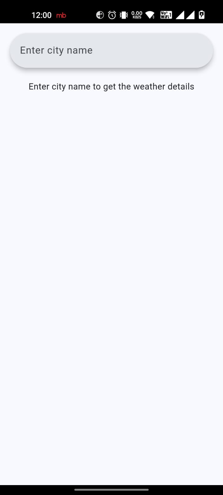
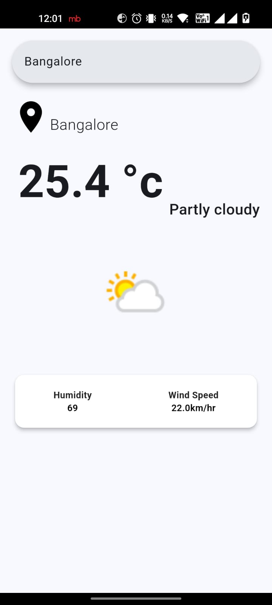

# Flutter Weather App with Backend Persistence

A Flutter application that displays weather details for a searched city and supports backend persistence to automatically show the last searched city's weather upon app startup. The backend is implemented using Java Servlets.

## Features

- Search for weather by city name
- Display current temperature, weather condition, humidity, and wind speed
- Responsive UI with Material 3 design principles
- Backend persistence to load the last searched city's weather on app startup

## Getting Started

### Prerequisites

- Flutter SDK: [Install Flutter](https://flutter.dev/docs/get-started/install)
- A weather API key from [WeatherAPI](https://www.weatherapi.com/)
- Java Development Kit (JDK) for backend support
- A suitable server to host your Java Servlets backend

### Installation

1. Clone the repository:

    ```bash
    git clone https://github.com/your-username/flutter-weather-app.git
    ```

2. Navigate to the project directory:

    ```bash
    cd flutter-weather-app
    ```

3. Install the dependencies:

    ```bash
    flutter pub get
    ```

4. Replace the placeholder (`#########`) in `constants.dart` with your actual weather API key:

    ```dart
    String apiKey = "your_api_key_here";
    ```

5. Set up and deploy the backend:
    - Implement Java Servlets to handle GET and POST requests for the preferred location.
    - Host the backend on a server and note the IP address and port number.

### Running the App

1. Start your backend server.

2. Run the Flutter app:

    ```bash
    flutter run
    ```

## Project Structure

```
flutter-weather-app/
├── lib/
│   ├── api.dart
│   ├── constants.dart
│   ├── homepage.dart
│   ├── main.dart
│   ├── prefapi.dart
│   ├── prefmodel.dart
│   └── weathermodel.dart
├── pubspec.yaml
└── README.md
```

### File Descriptions

- **main.dart**: Entry point of the application, initializes the app and sets up the main configuration.
- **homepage.dart**: Main interface of the app, allows users to search for weather details by entering a city name, and handles backend persistence.
- **api.dart**: Contains methods to interact with the weather API to fetch current weather data.
- **prefapi.dart**: Contains methods to interact with the backend for fetching and updating the preferred location.
- **prefmodel.dart**: Data model representing the preferred location response.
- **weathermodel.dart**: Data models representing the weather response, location, and current weather conditions.
- **constants.dart**: Contains the API key for authenticating requests to the weather API.

## Usage

1. Open the app.
2. If a city was last searched, its weather details will be displayed automatically.
3. Enter the name of a new city in the search bar to get updated weather details.

## Screenshots




## Key Components

- **SearchBar** widget for entering city names.
- **WeatherResponse** model parsing and displaying weather data.
- **Backend Persistence** with `WeatherAppLocationApi` for storing and fetching the last searched city.

### Example Weather Data

```json
{
  "location": {
    "name": "New York"
  },
  "current": {
    "temp_c": 22.0,
    "condition": {
      "text": "Clear",
      "icon": "//cdn.weatherapi.com/weather/64x64/day/113.png",
      "code": 1000
    },
    "wind_kph": 10.0,
    "humidity": 55
  }
}
```

## Contributing

Contributions are welcome! Feel free to submit a pull request or open an issue to suggest improvements or report bugs.

## License

This project is licensed under the MIT License - see the [LICENSE](LICENSE) file for details.

## Acknowledgements

- [Flutter](https://flutter.dev/) - UI toolkit
- [WeatherAPI](https://www.weatherapi.com/) - Weather data provider

---